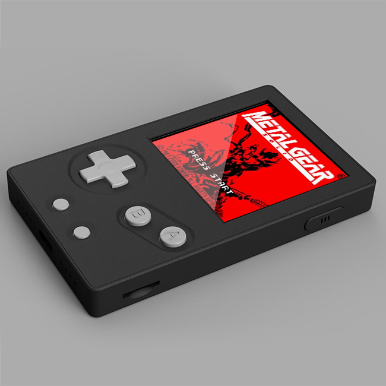
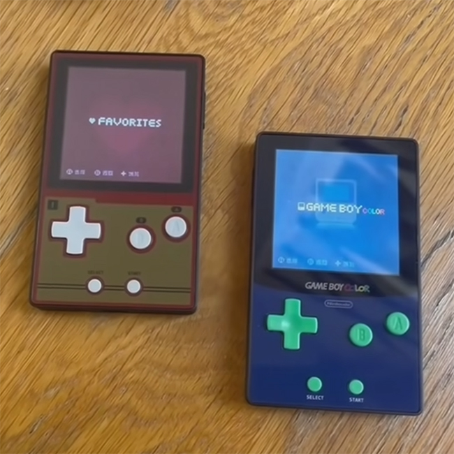
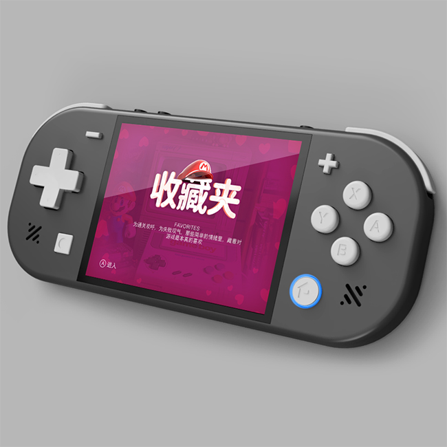
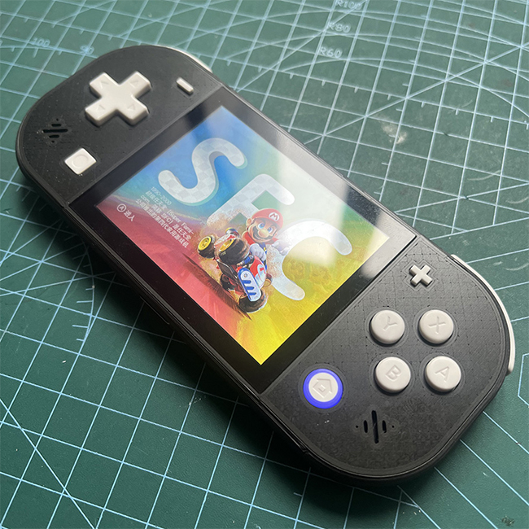

# 项目介绍
基于retro go （https://github.com/ducalex/retro-go）的dev分支进行魔改，支持中文等诸多个性化修改，目前已有Katarina和Majula两款掌机。

# Katarina
- esp32s3主控
- 2.5寸240x240SPI屏幕
- 可更换磁吸面板
- GBASP按钮
- 850毫安电池
- 12mm轻薄机身
- 定制主题

- 视频介绍（https://www.bilibili.com/video/BV1Khtjz5ENq/?spm_id_from=333.1387.homepage.video_card.click&vd_source=32704cec22311b37cf626be30a817df0）

# Majula
- esp32p4主控
- 2.8寸640x480MIPI屏幕
- switchlite按钮
- 独立音量按钮
- 双喇叭
- LED灯效
- 1600毫安电池
- 12mm轻薄机身
- 定制主题

- 视频介绍（https://www.bilibili.com/video/BV14s6SBDEGr/?spm_id_from=333.1387.homepage.video_card.click&vd_source=32704cec22311b37cf626be30a817df0）

